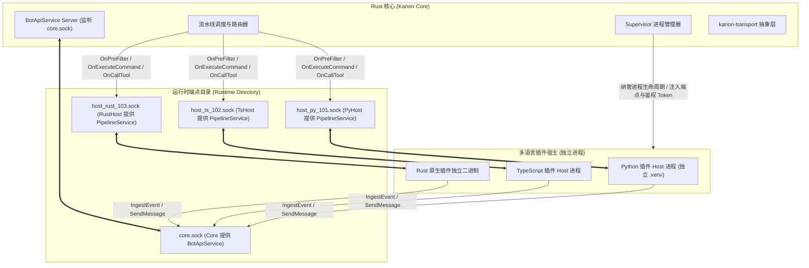
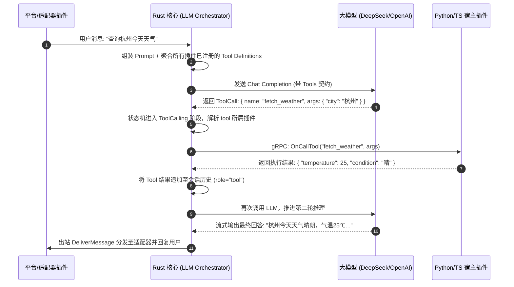

# Kanon 跨语言 Bot 架构设计与技术规范文档

> **项目名称**：Kanon (カノン)  
> **定位**：高性能、低内存占用、高并发的现代聊天机器人微内核引擎，支持 **Rust / Python / TypeScript** 多语言插件与适配器无缝接入，全系统严格模块化，前后端完全解耦。  
> **文档版本**：v1.1.0-draft  
> **状态**：方案制定与规范设计阶段  

---

## 1. 架构选型与背景对比

### 1.1 设计背景与核心工程挑战

在多平台聊天机器人与大模型（LLM）融合的应用场景中，随着业务复杂度增加，系统在生产环境及资源敏感环境中面临以下核心工程挑战：
- **资源占用与环境纯净度**：单体脚本运行时在冷启动与基础内存上存在一定门槛，跨机部署时常受限于目标环境的解释器版本与三方依赖库。
- **并发吞吐与网络心跳稳定性**：高频事件与大模型流式推理耗时较长，如果缺乏严格的异步解耦机制，容易导致 IM 网关底层的长连接心跳出现超时断连。
- **第三方扩展的物理故障隔离**：社区第三方插件生态多样，若单插件发生未捕获异常、耗时同步阻塞或底层动态库段错误 (SegFault)，在单进程模型下极易导致全系统瘫痪。

为此，Kanon 从设计之初即确立了微内核架构，兼顾极致的自包含性、高并发稳定性与多语言插件接入体验。

### 1.2 核心选型方案对比矩阵

针对“Rust 核心 + 多语言（Rust/Python/TS）插件接入”的目标，技术委员会对业界三种主流架构进行了评估：

| 评估维度 | 方案 A：进程外宿主 (Out-of-Process gRPC via UDS) ★选定 | 方案 B：单进程内嵌运行时 (PyO3 + V8/QuickJS) | 方案 C：WebAssembly 沙箱 (Wasmtime / Extism) |
| :--- | :--- | :--- | :--- |
| **故障隔离性** | **物理隔离**：插件崩溃/OOM 不影响主核心与其他会话 | **较弱**：插件 C 扩展崩溃可能导致主进程异常退出 | **极优**：内存/指令级硬沙箱隔离 |
| **生态兼容性** | **良好兼容**：pip / npm / Cargo 生态大部分功能开箱可用 | **良好但受限**：受制于 PyO3 与 Tokio 异步运行时的死锁风险 | **受限**：带底层 C/C++ 绑定的三方库难以编译为 WASI |
| **开发体验** | **原生调试**：各自语言的原生调试器、热重载与工具链 | **中等**：跨语言 FFI 较复杂，宏报错较难排查 | **繁琐**：需要专用工具链将源码编译为 .wasm |
| **进程间通信延迟**| **低延迟**：UDS 内部管道传输，基准耗时通常在微秒级（远低于网络 I/O）| **零开销**：直接内存共享访问 | **微秒级**：Wasm 内存拷贝 |
| **交付难度** | **标准解耦**：Rust 主二进制独立，按需联动 `uv`/`node`/`cargo` 纳管环境 | **困难**：分发时通常需动态链接特定版本的运行时动态库 | **单文件**：单二进制内嵌运行时 |

**结论**：选定 **方案 A（Out-of-Process Sidecar + gRPC over UDS）**，在保持 Rust 核心轻量精炼和高可靠的同时，为 Rust、Python 与 TypeScript 开发者提供统一的开发接入体验。

---

## 2. 总体拓扑与全模块化工程架构

### 2.1 独立端点通信拓扑 (Dedicated Endpoint per Host Model)

- **运行时目录与 POSIX 权限防御**：系统遵循 XDG 规范，使用跨平台隔离目录（如 Linux/macOS 优先使用 `$XDG_RUNTIME_DIR/kanon/run/`；Windows 下使用安全随机端口 TCP Loopback 并注入 32-Byte CSPRNG Token 校验）。在无桌面环境的纯净 Linux 服务器、Docker 容器或最小化 Alpine 系统中，环境变量 `$XDG_RUNTIME_DIR` 经常未被设置。若代码静默降级为标准 `/tmp/kanon-run/`，由于公共 `/tmp` 的黏滞位特性和共享可见性，会导致本地其他用户窥探甚至通过符号链接劫持 socket 文件。因此规范补充如下硬性分支规定：
  - **UID 隔离回退**：当 `$XDG_RUNTIME_DIR` 为空时，回退目录为 `/tmp/kanon-run-$UID/`（通过 POSIX `libc::getuid()` 获取调用方真实 Effective UID）。
  - **强制 0700 权限**：核心与 Supervisor 在创建或检测该目录时，必须通过系统调用强制显式设为 `0700`（仅当前 UID 拥有 `rwx------` 权限），若存在权限冲突或符号链接劫持则立即拒绝启动。
- **核心端点 (`core.sock`)**：Rust 核心启动 gRPC 服务端，监听 `core.sock`，向所有 Host 提供 `BotApiService`（主动发消息、事件灌入、LLM 代理等）。
- **宿主独立端点 (`host_<id>.sock`)**：Supervisor 为每个拉起的 Host 分配专属通信端点，Host 在该端点启动 gRPC 服务端，提供 `MessagePipelineService`。Rust 核心作为 Client 连接各 Host 端点发起命令调度与 Tool Calling。
- **架构收益**：保持标准 gRPC 纯粹语义，双向互相调用完全解耦，绝无应用层帧路由负担，每个端点均可使用 `grpcurl` 独立排障。



### 2.2 生产环境进程隔离与崩溃防护 (Process Isolation Strategy)

1. **生产环境默认独立子进程隔离 (Per-Plugin Process)**：
   - 为有效隔离单插件崩溃传播、同步 I/O 阻塞（如 `time.sleep`、无超时网络请求）拖垮同语言其他插件，**生产环境下每个插件默认独占独立子进程与专有依赖环境 (`.venv` / `node_modules`)**。
   - 某个插件遭遇 SegFault、OOM 或死锁，仅自身子进程退出，核心与其他插件不受影响。
2. **轻量开发环境共享模式 (Shared Host for Dev)**：
   - 仅在 `kanon-dev dev` 本地调试或用户显式配置 `group = "shared"` 时，才允许多个受信任的轻量插件合部在同一个共享 Host 进程中以节约开发机内存。

### 2.3 插件宿主进程完整生命周期 (Host Process Lifecycle)

进程隔离只有在"宿主进程生命周期完整"时才成立：**没有看门狗的宿主在 Core 被杀后会变成幽灵进程，继续持有平台长连接**；一旦新 Core 启动，幽灵与新生宿主会同时服务同一平台，导致每条消息被处理两次（两次回复、两次模型调用）。因此所有语言的宿主必须实现同一套生命周期：

| 阶段 | 行为 | 责任方 |
| :--- | :--- | :--- |
| 启动 | `Supervisor` 以 `KANON_HOST_ID` / `KANON_HOST_SOCK` / `KANON_CORE_SOCK` 注入环境并拉起子进程 | Core |
| 注册 | 宿主先绑定专属 `host_<id>.sock`，再 `RegisterHost`（注册即连通性探针；失败则显式进入 standalone） | 宿主 |
| 服务 | `MessagePipelineService`（事件/指令/工具/投递）+ `PluginHostService`（生命周期、配置热重载、管理动作） | 宿主 |
| 存活 | 定时 `BotApiService.Ping` 探活 Core；**连续 3 次失败（默认 15s 间隔）即自行退出**，避免抢占平台连接 | 宿主（Python `CoreWatchdog` / Rust `watch_core` / TS `startCoreWatchdog`） |
| 停止 | `SIGTERM`/`SIGINT` → 执行 `on_unload` → 关闭平台连接 → 卸载 socket | 宿主 |
| 回收 | Core 关停时先 `SIGTERM`，超过 3s 宽限期仍未退出则 `SIGKILL`；未就绪的宿主直接强杀 | Core (`terminate_child`) |
| 外部注册宿主 | 无子进程句柄不可杀；Core 仅将其移出注册表，宿主依靠自身看门狗退出 | Core + 宿主 |

> 由此可保证：任何一次 Core 退出（含 `SIGKILL`、终端关闭）都不会留下仍在服务平台的宿主；重启后平台连接数恒为 1。

### 2.4 全模块化工程结构划分 (Modular Workspace Architecture)

全系统严格模块化，前后端完全物理分离，各 crate / package 职责单一：

```
kanon/
├── Cargo.toml                      # 根 Workspace 配置
├── proto/
│   └── kanon/v1/plugin.proto       # 跨语言通用 gRPC 协议契约 (强类型 oneof & Struct 双模载荷)
├── crates/
│   ├── kanon-proto/                # gRPC 契约与 Tonic 桩代码生成 (含 prost-types)
│   ├── kanon-transport/            # 跨平台 IPC 传输层抽象 (UDS / 认证 Loopback TCP)
│   ├── kanon-core/                 # 核心事件循环、消息流水线、Supervisor 进程监管
│   ├── kanon-storage/              # 嵌入式持久化支持与插件安全目录隔离管理器
│   ├── kanon-llm/                  # LLM 多端点路由、Token 滑动窗口与 Tool Calling 状态机
│   ├── kanon-api/                  # Axum RESTful API 与实时 WebSocket 驱动（供独立前端连接）
│   └── kanon-dev/                  # 官方专用 CLI：项目管理、模板脚手架、开发热重载与沙盒测试
├── sdks/
│   ├── rust/                       # Rust 插件开发 SDK (kanon-sdk)
│   ├── python/                     # Python 插件开发 SDK (kanon-sdk-python)
│   └── typescript/                 # TypeScript 插件开发 SDK (kanon-sdk-ts)
└── webui/                          # 前后端完全独立的现代 Web 控制台 (Vue 3 / React SPA)
```

### 2.5 运行时设计原则：零外部硬依赖与按需惰性激活 (Zero Hard Dependency Principle)

> **核心哲学**：**Python 与 Node.js / Bun 并非运行 Kanon 微内核的必需品。**  
> Kanon 核心与 Rust 原生插件是独立自包含的原生二进制程序，可以在没有任何外部脚本解释器的纯净操作系统上独立运转。

1. **零硬依赖（独立纯净运行）**：
   - 若用户仅使用 Rust 原生插件、内置组件或基础 IM 网关，Kanon 完全不依赖、不探测、不接触任何 Python 或 Node 环境。
   - 核心具备轻量空载基准（在基础调度下内存占用通常低于 20MB），分发时仅需单个独立二进制文件。
2. **按需惰性激活 (On-Demand & Lazy Activation)**：
   - 核心启动时**不会盲目启动任何外部子进程**。
   - 仅当扫描 `plugins/` 目录且**确实存在**声明为 `runtime = "python"` 的插件时，Supervisor 才会尝试探测 Python/uv 并拉起 `kanon-pyhost`。
   - 同理，仅当**确实存在**声明为 `runtime = "typescript"` 的插件时，才会尝试探测 Node/Bun 并拉起 `kanon-tshost`。
3. **环境缺失优雅降级 (Graceful Degradation)**：
   - 若用户放入了 Python 或 TS 插件，但当前操作系统未安装对应运行环境：
     - Kanon 核心**不会直接崩溃或拒绝启动**；
     - 仅对缺少运行时的插件输出清晰友好的告警日志，将其状态标记为 `RuntimeUnavailable`；
     - 机器人核心、IM 适配网络连接及所有 Rust 插件依然照常运行。
4. **可选运行时的极简治理（仅在用户需要时生效）**：
   - **Python**：仅在激活 Python 插件时，优先检测极速工具 `uv`，免配复杂的全局环境。
   - **TypeScript**：仅在激活 TS 插件时，优先检测 `bun` 或 `node/tsx`。

### 2.6 事件入站异步队列与防锁步机制 (Async Ingest Queue & Lockstep Prevention)

为防范 **“LLM 慢推理/插件慢 I/O 反向阻塞 IM 适配器心跳”** 的时序锁步风险，系统确立严格的异步解耦规则：

1. **Fast-ACK 快速确认机制**：
   - 适配器插件调用 `BotApiService.IngestEvent` 时，Rust 核心仅执行两件事：事件有效性基本校验、放入带高水位（默认 10,000 缓冲）的内部 Tokio MPSC 异步通道。
   - 核心在非阻塞推入有界内存通道后立即 Fast-ACK 返回（基准投递延迟通常在微秒级，受 OS 调度与系统负载影响）。
2. **流水线异步消费与独立出站**：
   - 核心工作协程池独立从 MPSC 通道消费事件，调度 PreFilter 拦截链、LLM 编排与 Tool Calling 状态机。
   - 无论 LLM 生成耗时多久，反压均被内部有界队列隔离，绝不沿着 gRPC 链路逆向传导至适配器。
   - 最终出站响应通过独立的 `OnDeliverMessage` 单向调用适配器，适配器底层（WebSocket 心跳、长轮询）保持保活稳定性，大幅降低因业务阻塞导致的断连风险。

### 2.7 Windows 本地 Loopback TCP 密码学鉴权规范 (Loopback Token Authentication)

在 Windows 环境下采用本地端口（`127.0.0.1:EphemeralPort`）通信时，为有效防范同机器上非特权进程伪造请求或注入数据，制定硬性安全约束：

1. **32-Byte 随机 Token 注入**：
   - Supervisor 在拉起任何 Host 子进程前，通过密码学安全随机数生成器 (CSPRNG) 生成 32 字节高熵随机 Token（64 字符十六进制编码）。
   - Token 仅通过子进程私有环境变量 `KANON_IPC_TOKEN`（或私有安全 stdin 握手管道）单向注入该子进程，对外不可见。
2. **首包 HTTP/2 HEADERS 恒定时间校验**：
   - Host 连接 Core 或 Core 连接 Host 时，首帧必须携带 `x-kanon-auth-token`。
   - 接收端通过 `subtle::constant_time_eq` 恒定时间比对，校验失败立即切断连接。

### 2.8 Linux/macOS Unix Domain Socket 目录隔离与权限加固规范 (POSIX Socket Security)

在 Unix/Linux 环境下采用 UDS（Unix Domain Socket）通信时，为有效防范本地非特权多租户环境下的符号链接劫持、套接字投毒与非法窃听，制定强制安全约束：

1. **运行目录发现与 UID 安全隔离**：
   - 优先遵循 XDG Base Directory 规范使用 `$XDG_RUNTIME_DIR/kanon/run`；
   - 若环境变量 `$XDG_RUNTIME_DIR` 未设置（例如无桌面环境、部分 Docker 容器或基础 SSH 会话），强制安全回退至 `/tmp/kanon-run-$UID/`（通过 POSIX `libc::getuid()` 获取调用方真实 Effective UID），有效消除多用户同机共享未隔离路径的安全风险。
2. **符号链接攻击防御 (Symlink Rejection)**：
   - 在创建或绑定套接字前，核心与 Host 必须使用 `std::fs::symlink_metadata` 深度检查目录元数据；
   - 若目标运行目录属于符号链接（Symlink），直接拒绝并抛出 `std::io::ErrorKind::PermissionDenied`，防止本地非特权攻击者预先埋设软链接诱骗核心向敏感系统路径写入套接字。
3. **强制 0700 权限收敛 (Mandatory 0700 Permissions Enforcement)**：
   - 运行目录的所有者 UID 必须与当前进程所有者完全一致；
   - 无论是全新建立目录还是已存在的既有目录，统一调用 `Permissions::from_mode(0o700)`（`rwx------`）强制将目录权限收敛为仅当前用户可读写执行，剥夺同组及全局用户的读取与遍历权限。

### 2.9 kanon-transport 架构落地形态与 Tower 鉴权中间件

为消除 Tonic/Hyper 与操作系统底层的适配胶水代码，`kanon-transport` 提供统一抽象：

1. **统一流封装 (`IpcStream`)**：
   - 跨平台抽象底层 `UnixStream` 与 `TcpStream`，实现 `AsyncRead`、`AsyncWrite` 与 `tonic::transport::server::Connected`；
   - 核心与 Host 统一使用 `Server::builder().serve_with_incoming(...)`，零感知底层协议差异。
2. **Tower / Tonic 统一鉴权拦截器 (`AuthInterceptor`)**：
   - 将 Windows 安全鉴权封装为标准的 `tonic::service::Interceptor`；
   - 在 gRPC 解包前统一从 HTTP/2 HEADERS 中抽取 `x-kanon-auth-token` 并进行 `constant_time_eq` 恒定时间校验；
   - 鉴权逻辑严格隔离在 Transport 层，禁止将安全握手代码散落侵入至上层业务 RPC Handler。
3. **跨语言客户端的 HTTP/2 `:authority` 硬性约束**：
   - Core 服务端基于 Tonic/Hyper（`h2`），会对 `:authority` 做严格语法校验；百分号转义仅允许出现在 userinfo 或 IPv6 zone id 中，出现在 host 段即判定为畸形头，服务端在业务逻辑执行前直接回 `RST_STREAM(PROTOCOL_ERROR)`。
   - **禁止将 socket 路径写入 `:authority`**：gRPC C-core（Python）在 `unix:/abs/path/core.sock` 目标下会把百分号转义后的路径（如 `run%2Fuser%2F1000%2Fkanon%2Frun%2Fcore.sock`）当作 authority 发送，导致 `BotApiService` 全部 RPC 失败，且客户端只能看到与崩溃相似的误导性错误：`StatusCode.INTERNAL "Stream removed (RST_STREAM (Received RST_STREAM with error code 1))"`。改写为 `unix:///abs/path` 亦无效，必须显式固定合法 authority。
   - Python SDK 统一通过 `kanon_sdk.ipc.connect_core_channel()` 建链（固定 `grpc.default_authority`），禁止各 Host / 插件自行调用 `grpc.aio.insecure_channel("unix:...")`；Rust SDK（Tonic `http://localhost`）与 TypeScript SDK（gRPC-js unix resolver 固定 `localhost`）天然合规。

---

## 3. 插件清单规范 (Plugin Manifest Spec)

每个插件放置于独立目录下，以静态 `plugin.toml` 声明其所有元数据与静态能力。

```toml
[plugin]
id = "org.kanon.plugin.weather"
name = "实时天气与穿衣指南"
version = "1.0.0"
author = "Kanon Dev"
description = "提供 /weather 命令并向 LLM 注册天气检索工具"
runtime = "rust" # "rust" | "python" | "typescript"
entrypoint = "target/release/weather_plugin" # 或 "main.py" / "src/index.ts"
isolated = false

[dependencies]
packages = [
    "httpx>=0.25.0",
    "pydantic>=2.0"
]

# WebUI 配置项 JSON Schema (核心可不启动子进程直接渲染前端配置表单)
[config_schema]
type = "object"
properties = {
    api_key = { type = "string", title = "天气服务 API Key", description = "用于请求和风天气等三方服务的凭证" },
    default_city = { type = "string", title = "默认城市", default = "北京" },
    enable_cache = { type = "boolean", title = "启用本地响应缓存", default = true }
}
required = ["api_key"]

[[commands]]
name = "weather"
description = "根据城市名称查询天气"
usage = "/weather <城市名>"
priority = 100

[[tools]]
name = "fetch_weather"
description = "根据指定城市名称实时获取当前气温、风向与穿衣出行建议"
parameters = { type = "object", properties = { city = { type = "string", description = "城市名称，例如：北京、上海、杭州" } }, required = ["city"] }

# 平台适配器声明（可选）：声明后本插件成为该平台的适配器
# 核心据此把 platform 匹配的出站消息路由到本宿主（OnDeliverMessage），
# 插件侧再通过 BotApiService.IngestEvent 把平台入站消息推回流水线。
# 能力声明放在静态清单而非 PluginMeta：核心必须在收到第一条消息之前就知道平台归属。
[adapter]
platform = "weather_im"
display_name = "Weather IM Adapter"
```

---

## 4. 通信协议规范 (Protocol Buffers IDL)

协议采用强类型 `oneof` 联合体与 `google.protobuf.Struct` 双模载荷，显著降低 JSON 字符串二次序列化开销与二进制载荷的内存膨胀：

```protobuf
syntax = "proto3";
package kanon.plugin.v1;

import "google/protobuf/struct.proto";

// 1. 插件宿主生命周期服务 (运行在 Host 端)
service PluginHostService {
  rpc Ping (PingRequest) returns (PingResponse);
  rpc ReloadPluginConfig (ReloadPluginConfigRequest) returns (ReloadPluginConfigResponse);
}

// 2. 消息与事件管道服务 (运行在 Host 端，Core 寻址连接各 Host 端点发起调用)
service MessagePipelineService {
  rpc OnPreFilter (PipelineEventRequest) returns (PreFilterResult);
  rpc OnExecuteCommand (CommandExecuteRequest) returns (CommandExecuteResponse);
  rpc OnCallTool (ToolCallRequest) returns (ToolCallResponse);
  rpc OnEvent (EventNotification) returns (EventAck);
  rpc OnDeliverMessage (DeliverMessageRequest) returns (DeliverMessageResponse);
}

// 3. 核心 API 服务 (运行在 Core 端，监听 core.sock，Host 连接调用)
service BotApiService {
  rpc RegisterHost (RegisterHostRequest) returns (RegisterHostResponse);
  rpc IngestEvent (IngestEventRequest) returns (IngestEventResponse);
  rpc SendMessage (SendMessageRequest) returns (SendMessageResponse);
  rpc RequestLLM (LLMRequest) returns (stream LLMChunk);
  rpc SetStorage (SetStorageRequest) returns (SetStorageResponse);
  rpc GetStorage (GetStorageRequest) returns (GetStorageResponse);
}

// --- 强类型消息段定义 (彻底废除 map<string, string> 反模式) ---

message MessageSegment {
  oneof segment {
    TextSegment text = 1;
    ImageSegment image = 2;
    AudioSegment audio = 3;
    MentionSegment mention = 4;
    ReplySegment reply = 5;
    RawCustomSegment custom = 6;
  }
}

message TextSegment {
  string content = 1;
}

message ImageSegment {
  oneof source {
    string url = 1;
    string file_path = 2; // 本地物理路径，支持零拷贝直读
    bytes raw_bytes = 3;  // 裸二进制，避免 base64 膨胀
  }
  optional string mime_type = 4;
  optional string filename = 5;
}

message AudioSegment {
  oneof source {
    string url = 1;
    string file_path = 2;
    bytes raw_bytes = 3;
  }
  optional int32 duration_seconds = 4;
}

message MentionSegment {
  string target_user_id = 1;
  string display_name = 2;
  bool is_all = 3;
}

message ReplySegment {
  string target_message_id = 1;
  string snippet = 2;
}

message RawCustomSegment {
  string type_name = 1;
  google.protobuf.Struct payload = 2;
}

// --- 流水线事件与前置过滤核心定义 (含关键枚举) ---

message PipelineEventRequest {
  string event_id = 1;
  string platform = 2;
  string channel_id = 3;
  string sender_id = 4;
  string raw_text = 5;
  repeated MessageSegment segments = 6;
  google.protobuf.Struct metadata = 7;
}

message PreFilterResult {
  enum Action {
    PASS = 0;
    BLOCK = 1;
    MODIFY = 2;
  }
  Action action = 1;
  string modified_text = 2;
  repeated MessageSegment reply_messages = 3;
}

// --- Tool Calling 双模载荷定义 (消除四次序列化损耗) ---

message ToolCallRequest {
  string call_id = 1;
  string tool_name = 2;
  string session_id = 3;
  oneof payload {
    google.protobuf.Struct structured_args = 4; // 字典/参数对象零字符串解析
    bytes raw_bytes = 5;                        // 极速二进制通道
  }
}

message ToolCallResponse {
  string call_id = 1;
  bool success = 2;
  string error_message = 3;
  oneof payload {
    google.protobuf.Struct structured_result = 4;
    bytes raw_bytes = 5;
  }
}

// --- 插件生命周期与 CAS 配置更新消息 ---

message ReloadPluginConfigRequest {
  string plugin_id = 1;
  google.protobuf.Struct config = 2;
  uint64 version = 3; // CAS 乐观锁版本向量，防止并发覆盖
}

message ReloadPluginConfigResponse {
  bool success = 1;
  string error_message = 2;
  uint64 applied_version = 3; // 宿主实际生效的配置版本
}

// --- 平台消息投递消息 ---

message DeliverMessageRequest {
  string platform = 1;
  string channel_id = 2;
  string recipient_id = 3;
  repeated MessageSegment segments = 4;
  string event_id = 5; // 全链路追踪与死信队列归档关联 ID
}

message DeliverMessageResponse {
  bool success = 1;
  string message_id = 2;
  string error_message = 3;
}
```

### 4.1 OnPreFilter 拦截链执行顺序与性能预算 (Pipeline Deadline & Priority)

为防止多个外部 Python/TS 宿主在文本前置过滤阶段阻塞消息主流程，系统确立严格的执行流水线规范：

1. **优先级调度链 (Priority Chain)**：
   - 插件清单 `plugin.toml` 中必须显式声明 `priority`（范围 `1 ~ 1000`，数值越小越先执行，未声明默认 `500`）；
   - 核心 Pipeline 严格按 priority 升序依次调用各插件宿主的 `OnPreFilter`。
2. **总耗时预算与动态熔断 (Strict 30ms Deadline)**：
   - **全局预算**：整条 PreFilter 拦截链分配严格的总体 Deadline（**最大 30ms**）。
   - **单插件告警阈值**：单插件执行耗时超过 **5ms** 即在日志输出性能劣化警告。
   - **超时短路保护**：一旦链条累计耗时逼近 30ms，核心立即短路跳过后续尚未执行的 PreFilter 插件，直接放行消息进入命令匹配与大模型路由，杜绝慢脚本拉低系统吞吐。

---

## 5. 多语言 SDK 开发者体验规范 (Rust / Python / TypeScript)

### 5.1 Rust SDK 开发形态 (`sdks/rust/kanon-sdk`)

Rust 插件享有无缝的一等公民支持，天然类型安全，且无需任何 Python/Node 外部运行时：

```rust
use kanon_sdk::prelude::*;

#[derive(Default)]
pub struct MathPlugin;

#[async_trait]
impl Plugin for MathPlugin {
    async fn on_load(&mut self, ctx: &mut PluginContext) -> KanonResult<()> {
        println!("Rust 插件已加载，当前工作配置: {:?}", ctx.config);
        Ok(())
    }
}

// 注册命令响应器
#[command("calc")]
async fn handle_calc(ctx: Context, expr: String) -> KanonResult<()> {
    let result = evaluate_math(&expr)?;
    ctx.reply(vec![MessageSegment::text(format!("【Rust 计算引擎】结果: {}", result))]).await?;
    Ok(())
}

// 注册高性能 LLM Tool Calling
#[tool(name = "fast_prime_check", description = "高性能超大整数素数性检测工具")]
async fn check_prime(params: PrimeCheckParams) -> KanonResult<serde_json::Value> {
    let is_p = miller_rabin(params.number);
    Ok(serde_json::json!({ "number": params.number, "is_prime": is_p }))
}

#[tokio::main]
async fn main() -> KanonResult<()> {
    KanonHost::new(MathPlugin)
        .register_command(handle_calc)
        .register_tool(check_prime)
        .run()
        .await
}
```

### 5.2 Python SDK 开发形态 (`sdks/python/kanon-sdk-python`)

```python
from kanon_sdk import Plugin, Context, MessageSegment, command, tool

class WeatherPlugin(Plugin):
    async def on_load(self):
        # 自动由 Rust 核心下发的配置字典
        self.api_key = self.config.get("api_key")

    @command("weather")
    async def handle_weather(self, ctx: Context, city: str = "北京"):
        """响应 /weather <city> 指令"""
        weather_text = f"{city}天气晴朗，气温 25℃"
        await ctx.reply([
            MessageSegment.text(weather_text)
        ])

    @tool("fetch_weather")
    async def fetch_weather_tool(self, city: str) -> dict:
        """提供给 LLM Function Calling 的结构化工具"""
        return {
            "city": city,
            "condition": "晴朗",
            "temperature": 25,
            "advice": "适宜外出活动"
        }
```

### 5.3 TypeScript SDK 开发形态 (`sdks/typescript/kanon-sdk-ts`)

```typescript
import { Plugin, Context, Command, Tool, MessageSegment } from "@kanon/sdk";

export default class GreetingPlugin extends Plugin {
  @Command("greet")
  async handleGreet(ctx: Context, name?: string): Promise<void> {
    const target = name || ctx.sender.name;
    await ctx.reply([
      MessageSegment.text(`你好，${target}！来自 Kanon TypeScript 插件的高性能问候。`)
    ]);
  }

  @Tool({
    name: "calculate_tax",
    description: "计算输入金额的所得税"
  })
  async calculateTax(params: { amount: number; rate: number }): Promise<object> {
    const tax = params.amount * (params.rate / 100);
    return {
      gross: params.amount,
      tax: tax,
      net: params.amount - tax
    };
  }
}
```

---

## 6. 异常、自适应背压与熔断保障机制

1. **子进程崩溃自愈与故障物理隔离**：
   - 生产环境采用独立子进程，任何插件崩溃（OOM、SegFault、未捕获异常）均被完全限制在其子进程内部。
   - Supervisor 捕获退出状态码并触发指数退避重启（1s -> 2s -> 4s，最多重试 5 次），核心与其他插件保持正常运行。
2. **IPC 超时与分层熔断机制 (Tiered Timeouts & Circuit Breaking)**：
   - **插件调用超时控制**：指令执行默认超时 5 秒；LLM Tool Calling 默认超时 15 秒；PreFilter 链执行受整体超时预算控制（默认 30ms），超出预算时自动短路跳过后续插件，防止慢脚本拖垮整个流水线。
   - **平台出站熔断保护 (Platform Circuit Breaker)**：由 `PipelineEngine` 为各出站平台独立维护熔断状态机。当目标平台出站连续失败达 5 次时，自动进入 `Open` 状态进行快速短路与死信归档，并以 30 秒周期进入 `Half-Open` 试探探测，避免无效重试持续挤占系统计算资源与并发通道。
3. **优雅停机与资源回收**：
   - 主核心捕获 SIGINT/SIGTERM 后，向所有激活的 Host 广播停机通知，宿主触发插件 `on_unload` 钩子并在规定时限内平稳退出，核心自动清理运行时目录下的所有 socket 文件与临时状态。

---

## 7. 插件状态与数据持久化规范 (Persistence & Anti-Amplification Spec)

针对高频 PreFilter 场景下的 I/O 放大风险与进程隔离要求，采用 **读缓存本地化 + 独立数据目录物理隔离** 的工程原则：

1. **配置与元数据本地化缓存 (Read-Cache in Host Memory)**：
   - 只读配置项、白名单、动态参数在插件加载及核心推送 `ReloadPluginConfig` 时，直接常驻于 Host 进程内存字典中。
   - 过滤链与指令处理一律内存命中，严禁每条消息往返一次 gRPC 远程读取配置。
2. **专属物理数据目录与本地持久化 (Local Storage First - 唯一权威方案)**：
   - 核心在加载插件时，确保 `./data/plugins/<plugin_id>/` 物理隔离目录就绪，并将路径注入 `ctx.data_dir`。
   - **架构约束**：插件的所有持久化状态（如用户积分、业务会话、缓存、离线数据等）必须在插件内部直接使用嵌入式数据库（如 Python/TS/Rust 内置的 SQLite / DuckDB）或本地扁平文件存储在专属目录下。
   - 彻底避免在微内核中设计低效的集中式代理存储，保障数据隔离边界清晰且无跨进程序列化 I/O 开销。
3. **gRPC 集中式 KV 存储边界说明 (Centralized KV Deprecation Notice)**：
   - Protobuf 契约中虽保留历史 `SetStorage` / `GetStorage` 端点定义，但微内核当前明确将其标记为不支持，调用时显式返回 `Status::unimplemented`（指引插件使用专属数据目录本地持久化）。
   - 核心不内置全局集中式 KV 数据库，防止核心沦为单点数据库代理并规避多插件数据污染风险。

---

## 8. LLM 编排与 Tool Calling 状态机规范 (LLM Orchestration Spec)

### 8.1 核心职责与架构定位
Rust 核心全权主导 LLM 的生命周期与推理编排，确保高并发下的 Token 预算控制与流式吞吐：
- **统一模型网关**：内置支持 OpenAI-compatible、DeepSeek、Claude、Ollama 等多端点协议，支持动态权重与故障自动重试。
- **全局会话上下文管理 (Session Memory)**：
  - 基于 `channel_id:sender_id` 分配会话上下文。
  - 支持 Token 预算感知滑动窗口：自动估算历史 Token，超出限制时自动进行首尾修剪或调用轻量模型生成摘要压缩。
  - 支持 System Persona（人设提示词）动态装配。

### 8.2 模型推理通道的可见性边界 (Reasoning Visibility)

- OpenAI 兼容后端（如 DeepSeek 的 `reasoning_content`）返回的推理内容会被 provider 折叠为响应文本前置的 `<think>…</think>` 块，仅供管理控制台（Playground）拆分展示；**该编码只是显示约定，绝不可作为回复下发**。
- 因此出站路径（`PipelineEngine` 的 LLM 分支）在构造平台回复前必须调用 `kanon_llm::strip_reasoning_tags` 剥离推理块，只投递用户可见答案；推理块被截断（流式未闭合）时答案视为空，宁可不回复也不泄露思维链。
- 该解码器与 provider 的编码器成对维护，禁止在适配器/插件内各自实现标签解析。

### 8.3 工具与"管理动作"的边界 (Tools vs. Management Actions)

- **`tools`（LLM 可见）**：注册进 `ToolMeta` 的能力会被聚合后交给模型做 function calling。**适配器插件禁止声明任何 tool**——适配器的职责是平台收发，若其把"扫码绑定/凭证轮换"等运维能力注册为 tool，模型就会在闲聊中尝试调用它们。
- **`actions`（仅控制台可见）**：运维操作通过 `PluginHostService.InvokeAction` 暴露（Python SDK 用 `@action(...)` 声明，不会出现在 `Plugin.meta()` 中）。控制台走 `POST /api/v1/plugins/{id}/actions/{action}`，核心内部流程（如 QQ 扫码绑定）同样走该 RPC，因此这类能力永远不会进入模型的函数列表。
- 判定规则：**模型可以主动调用的 → tool；只能由人/控制台触发的 → action**。

### 8.4 扩展能力：MCP 服务器与技能 (MCP & Skills)

核心自身不内置任何业务工具，但允许两类**外部能力来源**与插件工具共用同一套 Tool Calling 状态机：

- **MCP 服务器**：核心内置 MCP 客户端（`stdio` 子进程与 `http` 端点两种传输），在 `tools/list` 后把每个工具注册为 `mcp__<server>__<tool>`。MCP 服务器与插件宿主一样实现 `ToolHost`，因此路由、审计追踪与熔断逻辑完全复用；连接按需建立，独立看门狗每 30 秒以 `tools/list` 作为存活探针，连续失败则标记为 `failed` 并在下一轮重连。
- **技能 (Skills)**：`data/skills/<id>/SKILL.md` 中的指令包。**只有 `name` 与 `description` 进入系统提示词**（`SkillCatalogHook`），完整正文由模型通过内置 `read_skill` 工具按需读取——这样上下文开销与实际需要成正比，而不是把全部技能塞进每次请求。单个技能正文上限 64 KiB。

两类能力与插件共享**同一套开关模型**，且全局开关优先：

| 层级 | 载体 | 语义 |
| :--- | :--- | :--- |
| 全局 | `data/toggles.json` 的 `plugins` / `skills` / `mcp` 分区 | 运维总闸；停用即彻底不可用 |
| 实例 | `BotInstance` 的 `plugins` / `skills` / `mcp` 覆盖表（`inherit` / `enable` / `disable`） | 仅能进一步限制，**不能**复活被全局停用的项 |

控制台的"工具列表"页签通过 `GET /api/v1/tools` 展示三类来源的合并结果：内置工具（`read_skill` 等，直接来自 Agent 的原生工具表）、运行中插件宿主声明的工具，以及已启用 MCP 服务器通告的工具；插件与 MCP 工具经由同一个 `resolve_tools` 解析，因此控制台显示的名称与模型收到的名称由构造保证一致（含重名时的 `plugin__tool` 命名空间）。被全局关闭的 MCP 服务器不会出现在其中——该接口列出的是"此刻真的可调用"的工具。

流水线在实例门禁之后立即按该策略过滤插件宿主（`PreFilter`、内置/插件命令、工具聚合因此同时生效），MCP 与技能策略则在聚合工具与构建技能目录时求值。策略通过会话键中的实例标识解析，因此共享同一 Agent 的不同实例不会串用彼此的工具与技能。

### 8.5 Tool Calling 跨语言执行状态机闭环



---

## 9. 管理控制面与前后端分离 API 规范 (Management Gateway Spec)

### 9.1 解耦部署架构
为保持 Rust 核心代码库的专精与纯粹，系统采用 **前后端解耦部署 (Decoupled Services)** 架构：
- **Rust Core (Backend)**：纯粹的无头服务（Headless Engine），专注于协议接入、事件调度、高频 IPC 与安全审计。通过 Axum 暴露轻量高性能的 OpenAPI/RESTful 接口与 WebSocket 实时推送信道。
- **WebUI (Frontend)**：作为独立的前端工程单独维护、构建与分发，用户可通过 Docker Compose、Vercel 或静态托管一键部署。

### 9.2 核心 RESTful 端点定义

> 全部端点由 `crates/kanon-api` 实现（Axum Router，路径参数采用 Axum 0.7 `:id` 语法，文档统一写作 `{id}`）。
> 统一错误信封：`{"error": {"code": "...", "message": "..."}}`，状态码语义为
> `400` 契约违规 / `404` 资源不存在 / `409` 当前状态下不可执行 / `503` 依赖未配置 / `502` 插件宿主机或模型网关失败。

| Method | Endpoint | Description |
| :--- | :--- | :--- |
| `GET` | `/api/v1/health` | 核心健康状态与基础运行指标 (Memory, Uptime, 插件与会话计数) |
| `GET` | `/api/v1/plugins` | 查询所有已发现插件清单、运行状态与静态元数据 |
| `GET` | `/api/v1/plugins/{id}/config` | 获取指定插件的配置项当前值、JSON Schema 及当前单调递增版本号 `version` |
| `PUT` | `/api/v1/plugins/{id}/config` | 校验配置 → 检查 CAS 乐观锁版本向量 → 触发跨进程热重载 → 原子持久化（版本冲突返回 409，宿主拒绝则不落盘） |
| `POST` | `/api/v1/plugins/{id}/restart` | 重启指定插件所在的宿主进程（依赖 Supervisor 记录的启动配方） |
| `POST` | `/api/v1/plugins/{id}/actions/{action}` | 触发插件的**管理动作**（运维操作，永不进入模型的函数列表；区别于 `tools`） |
| `GET` | `/api/v1/tools` | 列出模型当前可调用的**全部工具**及其提供方（内置 / 插件 / MCP），名称与分发规则和模型实际收到的完全一致 |
| `GET` | `/api/v1/sessions` | 分页查询会话元数据（Turn 计数、Token 消耗、活跃时间、Persona、作用域） |
| `POST` | `/api/v1/sessions/{id}/reset` | 安全重置会话历史，保留配置变量与人设 |
| `POST` | `/api/v1/sessions/{id}/persona` | 动态热切换指定会话的生效人设 |
| `GET` | `/api/v1/personas` | 查询系统预设及动态注册人设列表 |
| `GET` | `/api/v1/providers` | 查询可用协议与预设，以及本节点**当前生效**的提供商（含来源标记 `source`） |
| `PUT` | `/api/v1/providers/active` | 校验提供商描述 → 持久化至 `data/system.json` → 运行时热应用（流水线、`RequestLLM`、聊天接口下一请求即生效，无需重启） |
| `DELETE` | `/api/v1/providers/active` | 清除节点提供商并即时停用对话能力（环境变量引导不会被重新回填） |
| `GET` | `/api/v1/metrics` | 导出 Prometheus 格式的系统与消息吞吐指标 |
| `POST` | `/api/v1/chat/completions` | 在线沙盒对话调试，支持标准 JSON 与 `text/event-stream` 流式输出 |
| `GET` | `/api/v1/adapters` | 查询已注册的平台适配器（内置 + 插件声明）及其连接存活状态与断路器状态 (`circuit_state`) |
| `POST` | `/api/v1/adapters/{platform}/ingest` | 平台入站数据面：Fast-ACK 接收外部消息并推入核心流水线 |
| `GET` | `/api/v1/skills` | 查询已安装技能及其全局开关状态 |
| `POST` | `/api/v1/skills` | 安装技能（上传 zip 压缩包或指定本地目录，目录内必须含 `SKILL.md`） |
| `DELETE` | `/api/v1/skills/{id}` | 卸载技能 |
| `PUT` | `/api/v1/skills/{id}/enabled` | 全局启用/停用技能（实例级覆盖见 `/api/v1/instances`） |
| `GET` | `/api/v1/mcp/servers` | 查询已配置的 MCP 服务器及其连接健康度与工具数量 |
| `PUT` | `/api/v1/mcp/servers/{id}` | 新增或替换 MCP 服务器定义（`stdio` 子进程或 `http` 端点），保存后立即同步连接池 |
| `DELETE` | `/api/v1/mcp/servers/{id}` | 删除 MCP 服务器定义并断开连接 |
| `PUT` | `/api/v1/mcp/servers/{id}/enabled` | 全局启用/停用 MCP 服务器（停用即刻断开，释放子进程或连接） |

### 9.3 实时数据流 (WebSocket)

- **实时日志流**：`ws://host:port/ws/v1/logs` —— 采用结构化 JSON 实时回传主核心及各子进程的标准输出日志（支持按 log level、plugin_id 过滤）。
- **事件追踪总线**：`ws://host:port/ws/v1/events` —— 用于控制台实时可视化展示消息到达、PreFilter 状态、LLM Tool Calling 过程及最终出站全链路追踪。
- **过滤协商**：两条信道均支持查询参数（`level` / `plugin_id` / `session_id` / `kind`）与运行时 `{"type":"filter",...}` 控制帧；
  连接建立后先回送 `ready` 帧回显生效过滤器，订阅端滞后于广播缓冲时显式推送 `{"type":"lagged","skipped":N}`，绝不静默丢弃。
- **事件分层**：流水线事件以 `kind="pipeline"` 承载，并附带细粒度 `stage` 字段
  （`ingested` → `pre_filter_started` → `pre_filter_passed` / `pre_filter_blocked` → `command_matched` → `llm_replied` → `outbound_queued`），
  控制台既可订阅 `kind=pipeline` 观察全链路，也可按 `kind=ingested` 等单阶段精确过滤；LLM 与 Tool Calling 阶段由 `EventBus` 本身作为
  `AgentHook` 注入 Agent，与流水线阶段共用同一条有序事件流。

### 9.4 无头节点运行形态 (`kanon-api` 二进制)

`crates/kanon-api` 同时提供 `kanon-api` 可执行文件，作为无头节点的组合根：同一进程内启动
`core.sock` IPC 服务、流水线工作循环、Supervisor 与 Axum 管理网关，并将可观测性中心同时接入 `tracing` 与控制台广播信道。

| 环境变量 | 默认值 | 说明 |
| :--- | :--- | :--- |
| `KANON_API_ADDR` | `127.0.0.1:8080` | 管理网关监听地址（默认仅回环，避免误暴露） |
| `KANON_WEBHOOK_PLATFORM` | `webhook` | 内置 Webhook 适配器服务的平台标识（入站路径 `/api/v1/adapters/<平台>/ingest`） |
| `KANON_WEBHOOK_CALLBACK_URL` | 未设置 | 出站回调地址；未设置时适配器仅支持入站，控制面显示 `connected: false`，出站投递显式报错而非假装成功 |
| `KANON_LLM_BASE_URL` | 未设置 | 模型网关基址；未设置时聊天调试端点显式返回 `503`，绝不以假 Provider 掩盖缺失配置 |
| `KANON_LLM_API_KEY` | 未设置 | 模型服务凭证 |
| `KANON_LLM_MODEL` | `gpt-4o-mini` | 默认模型标识 |
| `KANON_LLM_PROTOCOL` | `openai` | `openai` / `openai_responses` / `anthropic`，未知取值在启动期直接报错 |
| `RUST_LOG` | `info` | 标准 `tracing` 过滤指令 |

插件配置持久化位置遵循数据隔离规范：`./data/plugins/<plugin_id>/config.json`，采用「临时文件 + `rename`」原子提交，
写入顺序为 **校验 → 宿主热重载确认 → 落盘**，宿主拒绝时不会留下半更新配置。

**CAS 乐观并发控制与单调版本向量 (CAS Optimistic Concurrency Control)**：
- 为彻底消灭并发修改或多控制台重叠提交引发的「配置时序倒退」与「静默脏写」隐患，管理控制面引入严格的 CAS 版本向量机制；
- `GET /api/v1/plugins/{id}/config` 返回当前配置值、JSON Schema 及单调递增版本号 `version`；
- `PUT /api/v1/plugins/{id}/config` 载荷支持携带可选的 `expected_version`。Supervisor 内存中维护各插件当前的最新单调递增版本向量：
  - 若调用方传入的 `expected_version` 与服务端当前维护的版本号不一致（或并发重载产生竞态），核心立即终止操作并返回 HTTP `409 Conflict` (`stale_config_version`)，杜绝旧配置覆盖新配置；
  - 校验通过后，Supervisor 递增版本号并将新版本携带在 `ReloadPluginConfigRequest.version` 中下发至宿主；
  - 跨语言插件宿主（Rust、Python、TypeScript）校验版本单调递增性，应用成功后在 `ReloadPluginConfigResponse.applied_version` 回传已应用的配置版本，实现跨进程配置时序强一致性。

### 9.5 平台适配器契约 (Platform Adapter Contract)

微内核自身不实现任何 IM 协议：**平台适配器**独占一个平台标识（与 `PipelineEventRequest.platform` 同值），负责两个方向：

1. **入站 (Inbound)**：把平台消息经 `EventIngress` 非阻塞推入核心 → 保持 Fast-ACK 语义（队列满时返回 `accepted=false` 或 HTTP `503`，绝不阻塞平台回调）。
2. **出站 (Outbound)**：把 `DeliverMessageRequest` 真正投递到平台 API，失败必须显式上报。

两条实现路径共用同一契约与同一条出站路由：

| 路径 | 注册方式 | 出站投递 | 入站 |
| :--- | :--- | :--- | :--- |
| **内置 (Built-in)** | 进程内实现 `PlatformAdapter` 并注册到 `AdapterRegistry`（内置优先于插件，是运维的显式覆盖） | 直接调用适配器 `deliver()`，零 IPC 开销 | 由适配器自行推送（HTTP 网关路由或自建长轮询任务） |
| **插件 (Plugin)** | `plugin.toml` 声明 `[adapter] platform = "..."`，核心从静态清单发现，**无需注册调用** | `MessagePipelineService.OnDeliverMessage` RPC 投递到宿主进程 | 插件经 `BotApiService.IngestEvent` 推回；Rust/Python/TS SDK 的 `ctx.core.ingest_event(...)` 已封装 |

**出站调度与背压**：流水线工作循环绝不等待平台 I/O。回复统一进入全局有界出站队列后，由 Dispatcher 按 `platform` 分区路由至独立的单平台 Worker 队列（默认容量 64）：
- **平台并发隔离**：不同平台间并发执行，单一卡顿或故障平台绝不阻塞其他平台的出站吞吐量（避免跨平台队头阻塞）；
- **平台内时序保障**：同一平台内部由独立 Worker 串行消费，严格保证 FIFO 消息递送顺序；
- **背压与死信追踪**：单平台队列饱和时，溢出消息立即丢弃并自动持久化归档至死信日志，同时上报 `outbound_failed` 阶段，不静默膨胀内存。

**出站单平台故障熔断器 (Circuit Breaker)**：
若目标平台 API 出现长时间物理级宕机（例如网络切断或服务崩溃持续数小时），每条出站消息重试 2 次会造成单平台队列持续占满，队列持续溢出并对同一故障地址发起无意义的重试请求。为此系统补齐单平台独立熔断机制：
- **短路阈值**：当特定平台的出站调用连续失败达到 **5 次**时，该平台的 Dispatcher Worker 自动进入 `CircuitOpen` 状态。
- **短路行为**：熔断期间后续消息直接丢弃或落盘到死信存储并上报 `outbound_failed`，不再触发实际网络 I/O，并以 30 秒为周期进入 `Half-Open` 状态发送单条试探探测，探测成功后恢复，防止阻塞 worker 协程与连接句柄。
- **控制面状态透出**：`GET /api/v1/adapters` 实时输出各个适配器的熔断器健康状态（`circuit_state: "closed" | "open" | "half_open"`），使运维能够实时监控各平台连接质量与故障熔断状态。

**出站死信队列与持久化归档 (Outbound Dead-Letter Queue & Cold Persistence)**：
- 因平台出站队列饱和背压丢弃、网络重试耗尽失败，或因断路器 `Open` 极速短路拦截的所有出站消息，均受核心死信引擎（`DeadLetterWriter`）全程护航，绝不静默丢失；
- 死信日志按平台标识与 UTC 自然日期进行目录隔离与文件分片持久化，归档路径为：
  `./data/dead_letter/<platform>_<YYYY-MM-DD>.jsonl`；
- 每条死信记录包含 `event_id`（全链路追踪关联 ID）、`platform`、`target_id`、`channel_id`、`reason`（失败原因/熔断说明）、`timestamp_millis`（毫秒时间戳）以及结构化的 `segments` 消息段载荷，为不可逆投递失败提供完整的审计追溯与运维离线补发对账能力。

**Webhook 鉴权与出站退避重试**：
- **HMAC-SHA256 签名校验**：配置 `secret` 时，入站 `/api/v1/adapters/{platform}/ingest` 严格校验 `X-Hub-Signature-256` / `X-Kanon-Signature`（恒定时间比对防时序攻击），验签失败直接返回 HTTP 401 `unauthorized`；出站自动为 Payload 计算签名并注入请求头。
- **指数退避重试策略**：出站遇网络断连、超时或 HTTP 5xx / 429 瞬态错误时，执行指数退避重试（默认 2 次重试，初始间隔 50ms）；遇到 HTTP 4xx 客户端错误则判定为永久故障，绝不盲目重试。

**插件侧能力**：声明 `[adapter]` 但未实现出站钩子的插件会收到明确的失败响应（`success=false` + 原因），
核心据此记录投递失败 —— 契约不允许「假成功」。三语言 SDK 的默认 `on_deliver_message` / `onDeliverMessage` 均已改为显式拒绝。

---

## 10. 开发者工具链与 CLI 规范 (`kanon-dev` Toolchain Spec)

系统提供统一轻量级的命令行工程与插件管理工具 **`kanon-dev`**（由 `crates/kanon-dev` 编译），赋能 Rust、Python、TypeScript 插件全生命周期的极速开发与调试：

### 10.1 核心命令体系

| 命令 | 功能说明 | 跨语言行为 |
| :--- | :--- | :--- |
| **`kanon-dev plugin create <name> --lang <rust\|python\|ts>`** | 自动生成标准插件骨架项目 | - `rust`: 生成 `Cargo.toml`、`src/lib.rs` 或 `main.rs` 与 `plugin.toml`<br>- `python`: 生成基于 `uv` 的 `pyproject.toml`、`main.py`<br>- `ts`: 生成 `package.json`、`tsconfig.json`、`src/index.ts` |
| **`kanon-dev dev`** | 启动热重载开发服务器 | 监听插件源码变动。Rust 插件执行增量编译并重启；Python/TS 插件秒级热重启 Host 进程 |
| **`kanon-dev test <path>`** | 脱机交互与测试驱动器 | 提供纯命令行终端沙盒，直接输入 `/calc`、`/weather` 或触发 Tool Calling，脱机验证插件输出 |
| **`kanon-dev lint <path>`** | 静态清单与类型规范校验 | 静态校验 `plugin.toml` 的 JSON Schema、命令命名冲突与权限合法性 |
| **`kanon-dev pack <path>`** | 打包可分发插件制品 | 自动校验依赖并打包为 `.kpk` (Kanon Plugin Package) 标准分发包，供发布到插件中心 |

### 10.2 插件分发包物理格式规范 (`.kpk` Package Specification)

`.kpk` (Kanon Plugin Package) 是 Kanon 生态的标准化分发归档格式，物理上为**标准 ZIP 容器 + SHA-256 完整性校验文件**：

1. **根目录强制契约**：
   - 根目录下必须包含合法的 `plugin.toml` 清单文件；
   - 必须包含 `README.md` 与可选的 `LICENSE`。
2. **多语言制品打包规范**：
   - **Rust 插件**：打包对应编译目标的预编译原生可执行文件（如 `bin/x86_64-unknown-linux-gnu/<plugin>` 或 `bin/x86_64-pc-windows-msvc/<plugin>.exe`），做到用户端零编译闪电加载；
   - **Python 插件**：携带插件源码与锁定版本依赖文件（优先 `uv.lock`，或 `requirements.txt`），安装时由核心联动 `uv` 闪电复现虚拟环境；
   - **TypeScript 插件**：携带转译后的 `dist/` 或源码及附带锁定文件的 `package.json`（支持由 `bun` 或 `node/tsx` 直接加载）。

---

## 11. 设计缺陷修正与工程优化对照表 (Defect Fixes & Optimization Matrix)

| 架构维度 | 初稿设计隐患 (V1.0) | 工程收敛方案 (Convergence Baseline) | 核心收益与防护目标 |
| :--- | :--- | :--- | :--- |
| **IPC 路由与端点绑定** | 单一 Socket 混杂监听，多客户端反向 RPC 寻址悖论 | **独立端点目录隔离模型**（Core 监听 `core.sock`，各 Host 监听专属 `host_<id>.sock`） | 保持标准 gRPC 纯粹语义，双向调用完全解耦，支持使用 `grpcurl` 独立排障。 |
| **故障隔离边界** | 默认单一共享 Host 进程，单插件阻塞/崩溃累及全盘 | **生产默认独立子进程隔离 (`Per-Plugin Process`)**，仅在开发调试模式支持合批共享 | 有效隔离同步代码阻塞与 C 扩展段错误 (SegFault) 导致的跨插件连环瘫痪。 |
| **跨平台传输层** | 硬编码 `/tmp/` 路径，Windows 缺失或存在事件循环兼容坑 | **抽象独立 Crate `kanon-transport`**，Linux/macOS 走 UDS，Windows 走安全认证本地 Loopback TCP | 统一 `IpcListener`/`IpcStream` 抽象，规范跨平台传输层实现。 |
| **富媒体消息载荷** | 弱类型 `map<string, string>` 反模式，二进制被迫 base64 膨胀 | **`oneof` 强类型联合体**，明确划分文本、图片、音频、艾特，支持本地零拷贝路径与裸二进制 | 恢复 Protobuf 类型安全优势，降低内存膨胀与额外解析开销。 |
| **Tool Calling 序列化** | 采用 string JSON 传参，跨进程带来四次序列化/反序列化消耗 | **双模载荷 (`oneof { google.protobuf.Struct; bytes }`)** | 大模型字典参数免除字符串解析损耗，同时保留超大二进制张量的直传通道。 |
| **持久化访问开销** | 高频 PreFilter 频繁发起 gRPC 远程读取 KV，I/O 放大严重 | **读缓存常驻 Host 内存 + 业务持久化直接下沉至插件专属目录**（本地 SQLite/DuckDB） | 消除集中式数据库代理延迟与数据放大，保障插件存储物理隔离。 |
| **容灾与超时保护** | 仅依赖静态超时判定，高负载与 GC 停顿引发级联超时雪崩 | **流水线 PreFilter 全局预算 + 单平台出站独立熔断器 (Circuit Breaker)** | 限制插件链慢调用，快速短路已宕机平台，降低系统级联雪崩风险。 |
| **运行时依赖定位** | 容易被误解为 Python/Node 为强依赖 | **明确核心自包含与按需探测原则**，纯 Rust 运行时具备低开销基线，Python/Node 仅按需惰性探测 | 保持 Rust 极简纯净单二进制分发的部署优势。 |
| **入站与心跳锁步** | 适配器同步阻塞等待核心处理，大模型慢推理导致 IM 网关反向断连 | **Fast-ACK 异步队列机制**（入站 Tokio MPSC 快速返回，出站独立 OnDeliverMessage） | 解耦入站流水线与出站投递，保障适配器心跳不被下游慢推理阻塞。 |
| **Windows 本地安全性** | 开放 127.0.0.1 端口暴露于同机非特权进程，存在指令嗅探注入风险 | **CSPRNG 32-Byte 随机 Token 握手鉴权**（私有环境变量注入 + gRPC 首帧恒定时间比对） | 有效防范本机未授权非特权进程伪造请求或探测。 |
| **Linux IPC 路径与权限安全** | 默认目录权限宽松或依赖不可靠的共享 `/tmp/`，面临符号链接劫持与多租户权限越界 | **基于 UID 隔离的 `/tmp/kanon-run-$UID/` 降级路径 + 强制 `0700` 权限收敛与符号链接深度拦截** | 消除本地多用户非特权攻击者对 UDS 套接字的窃听、替换与权限越界风险。 |
| **插件配置并发更新竞争** | 多并发热更新时缺乏时序锁，后发请求可能被先发慢请求覆盖产生时序倒退 | **CAS (Compare-And-Swap) 乐观并发控制与单调版本向量**（冲突返回 HTTP 409 Conflict，三语言 SDK 验证版本号） | 保证跨进程与控制面配置更新的严格线性一致性与时序安全性。 |
| **出站平台级联雪崩与抖动** | 外部平台接口严重劣化或停机时，出站重试导致单平台队列严重堵塞甚至反压 | **单平台独立短路熔断器 (Circuit Breaker)**（连续 5 次失败转为 Open，极速短路，30s 半开自愈探测） | 避免无效重试持续消耗系统资源，保护底层连接池。 |
| **出站饱和丢包与死信排查** | 队列背压打满或永久失败后丢弃消息仅有日志，无法离线对账与重放补发 | **按平台与日期分片的死信冷存储归档 (DLQ JSONL)**（落地 `./data/dead_letter/<platform>_<date>.jsonl`） | 实现不可逆出站失败的审计追踪与离线排查能力。 |

---

## 12. 系统边界与已知局限 (System Boundaries & Known Limitations)

为贯彻“简单优先、显式优先、失败优先、验证优先”的工程准则，本节坦诚列出当前架构版本的明确系统边界与已知局限性：

### 12.1 存储模型边界 (Storage Model Boundaries)
- **无内置全局集中式 KV 存储**：微内核已彻底移除原存根性质的内存 KV 模块（`crates/kanon-storage/src/kv.rs` 已删除）。`BotApiService.SetStorage` 与 `GetStorage` 端点当前显式返回 `Status::unimplemented`。
- **本地专属存储第一原则**：所有业务持久化（用户状态、业务缓存等）必须在插件所属的 `./data/plugins/<plugin_id>/` 独立目录中本地持久化（推荐 SQLite、DuckDB 或文件系统）。核心不代理业务读写，亦不提供跨插件共享的分布式数据库抽象。
- **会话元数据运行时与持久化边界 (Session Metadata vs History Boundary)**：
  - **对话历史消息与窗口持久化**：用户与模型的多轮对话历史、系统提示词及滑动窗口截断状态均通过 `SqliteMemory`（`crates/kanon-llm/src/sqlite_memory.rs`）以 SQLite WAL 模式强持久化，在单会话内具备串行写入一致性与跨进程重启持久性。
  - **会话运行时状态瞬态性 (`RuntimeSessionMetadata`)**：`SessionMetadata`（即 `RuntimeSessionMetadata`，包含动态局部变量 `variables`、活跃轮次计数 `turn_count`、空闲超时探测状态）由 `SessionManager` 在内存（DashMap）中维护，为运行期瞬态数据。微内核重启时运行时活跃会话计数与内存变量将平滑重置，而底层对话消息历史完整保留。

### 12.2 宿主环境与语言运行时依赖 (Language Host Runtime Dependencies)
- **Rust 核心自包含**：`kanon-core` 与 `kanon-api` 编译产物为零动态外部依赖的单一原生二进制。
- **外部多语言宿主依赖宿主环境**：Python 插件需要主机安装 Python 3.10+ 及包管理器（如 `uv` / `pip`）；TypeScript 插件需要系统安装 `bun` 或 `node`/`tsx`。若系统未安装相应运行时，核心在尝试拉起外部宿主时会显式记录错误并拒绝激活该插件，但不会影响 Rust 原生插件与核心流水线的持续运行。

### 12.3 单机有界队列与背压行为 (Single-Node Bounded Queue & Backpressure)
- **非分布式消息队列**：流水线调度基于 Tokio 进程内内存 MPSC 通道（入站默认容量 1024，单平台出站默认容量 64），不具备类似 Kafka / RabbitMQ 的跨节点分布式容灾与持久化确认机制。
- **背压饱和丢弃**：入站队列饱和时，核心立即通过 Fast-ACK 返回 `accepted: false`（HTTP 503）；出站平台队列饱和或断路器处于 `Open` 状态时，消息直接转入死信日志（DLQ JSONL）进行冷归档，不提供消息重放消费者，需由运维人员或外部审计工具介入重放。

### 12.4 性能基准声明与调优空间 (Performance Benchmark & Tuning Disclaimer)
- **指标基线定位**：文档中所提及的时延与吞吐目标（如 PreFilter 30ms 预算、出站熔断连续 5 次阈值等）均为架构级工程约束与默认配置基线，而非在所有硬件环境下的绝对物理性能保证。
- **实际性能变量**：端到端延迟主要受大语言模型提供商的网络 RTT、推理生成速度、外部 IM 平台 API 速率限制以及 Python/TS 宿主 GC 与脚本效率影响。生产环境应结合实际负载压测调整通道缓冲区大小与超时时间。

### 12.5 单机拓扑与容灾边界 (Single-Node Topology & HA Scope)
- **单节点进程模型**：微内核当前设计为单机单节点运行形态，Supervisor 仅负责管理本机子进程，不包含跨主机心跳、主备选举或分布式协同功能。
- **高可用建议**：生产部署时建议通过外部进程管理工具（如 `systemd`、Docker Compose 或 Kubernetes）提供进程级与容器级的高可用拉起守护。
