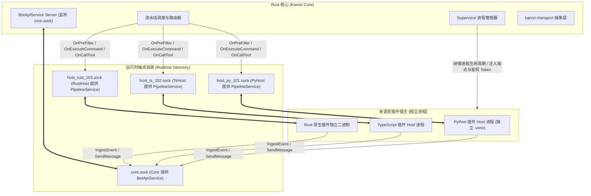
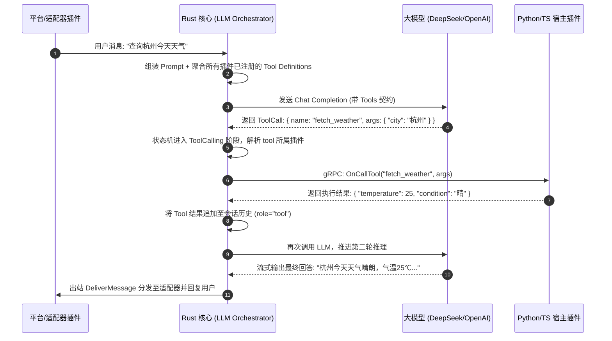

# Kanon 跨语言 Bot 架构设计与技术规范文档

> **项目名称**：Kanon (カノン)  
> **定位**：高性能、低内存占用、高并发的现代聊天机器人微内核引擎，支持 **Rust / Python / TypeScript** 多语言插件与适配器无缝接入，全系统严格模块化，前后端完全解耦。  
> **文档版本**：v1.1.0-draft  
> **状态**：方案制定与规范设计阶段  

---

## 1. 架构选型与背景对比

### 1.1 设计背景与核心工程挑战

在多平台聊天机器人与大模型（LLM）融合的应用场景中，随着业务复杂度增加，系统在生产环境及资源敏感环境中面临以下核心工程挑战：
- **资源占用与环境纯净度**：单体脚本运行时在冷启动与基础内存上存在一定门槛，跨机部署时常受限于目标环境的解释器版本与三方依赖库。
- **并发吞吐与网络心跳稳定性**：高频事件与大模型流式推理耗时较长，如果缺乏严格的异步解耦机制，容易导致 IM 网关底层的长连接心跳出现超时断连。
- **第三方扩展的物理故障隔离**：社区第三方插件生态多样，若单插件发生未捕获异常、耗时同步阻塞或底层动态库段错误 (SegFault)，在单进程模型下极易导致全系统瘫痪。

为此，Kanon 从设计之初即确立了微内核架构，兼顾极致的自包含性、高并发稳定性与多语言插件接入体验。

### 1.2 核心选型方案对比矩阵

针对“Rust 核心 + 多语言（Rust/Python/TS）插件接入”的目标，技术委员会对业界三种主流架构进行了评估：

| 评估维度 | 方案 A：进程外宿主 (Out-of-Process gRPC via UDS) ★选定 | 方案 B：单进程内嵌运行时 (PyO3 + V8/QuickJS) | 方案 C：WebAssembly 沙箱 (Wasmtime / Extism) |
| :--- | :--- | :--- | :--- |
| **故障隔离性** | **物理隔离**：插件崩溃/OOM 完全不影响主核心与 IM 会话 | **极差**：插件 C 扩展崩溃导致 Rust 进程直接 crash | **极优**：内存/指令级硬沙箱隔离 |
| **生态兼容性** | **原生 100% 兼容**：pip / npm / Cargo 生态全功能可用 | **良好但受限**：受制于 PyO3 与 Tokio 线程池死锁风险 | **极差**：大部分带 C 绑定的三方库无法编译为 WASI |
| **开发体验** | **极致原生**：各自语言的原生调试器、热重载与装饰器 SDK | **中等**：跨语言 FFI 复杂，C/Rust 宏报错晦涩 | **繁琐**：需要复杂的编译工具链将源码编译为 .wasm |
| **进程间通信延迟**| **极低**：UDS 内部管道传输，耗时 **30~80 微秒**（远低于网络 I/O）| **零开销**：直接内存共享访问 | **微秒级**：Wasm 内存拷贝 |
| **交付难度** | **标准解耦**：Rust 主二进制独立，联动 `uv`/`node`/`cargo` 纳管环境 | **极难**：分发时必须动态链接特定版本的 libpython | **单文件**：单二进制内嵌运行时 |

**结论**：选定 **方案 A（Out-of-Process Sidecar + gRPC over UDS）**，在保持 Rust 核心极致小巧和高可靠的同时，为 Rust、Python 与 TypeScript 开发者提供完全统一的一等公民开发待遇。

---

## 2. 总体拓扑与全模块化工程架构

### 2.1 独立端点通信拓扑 (Dedicated Endpoint per Host Model)

针对标准 UDS 下多客户端与服务端反向 RPC 路由的寻址悖论，Kanon 彻底抛弃单一 Socket 混杂监听模式，采用 **基于运行时目录的独立端点隔离模型 (Runtime Endpoint Directory)**：

- **运行时目录**：系统遵循 XDG 规范，使用跨平台隔离目录（如 Linux/macOS 下 `$XDG_RUNTIME_DIR/kanon/run/`；Windows 下使用安全随机端口 TCP Loopback）。
- **核心端点 (`core.sock`)**：Rust 核心启动 gRPC 服务端，监听 `core.sock`，向所有 Host 提供 `BotApiService`（主动发消息、事件灌入、LLM 代理等）。
- **宿主独立端点 (`host_<id>.sock`)**：Supervisor 为每个拉起的 Host 分配专属通信端点，Host 在该端点启动 gRPC 服务端，提供 `MessagePipelineService`。Rust 核心作为 Client 连接各 Host 端点发起命令调度与 Tool Calling。
- **架构收益**：保持标准 gRPC 纯粹语义，双向互相调用完全解耦，绝无应用层帧路由负担，每个端点均可使用 `grpcurl` 独立排障。



### 2.2 生产级进程隔离与崩溃防护 (Production Isolation Strategy)

1. **生产环境默认独立子进程隔离 (Per-Plugin Process)**：
   - 为彻底消除单插件崩溃传播、同步 I/O 阻塞（如 `time.sleep`、无超时网络请求）拖垮同语言其他插件的问题，**生产环境下每个插件默认独占独立子进程与专有依赖环境 (`.venv` / `node_modules`)**。
   - 某个插件遭遇 SegFault、OOM 或死锁，仅自身子进程退出，核心与其他插件毫发无伤。
2. **轻量开发环境共享模式 (Shared Host for Dev)**：
   - 仅在 `kanon-dev dev` 本地调试或用户显式配置 `group = "shared"` 时，才允许多个受信任的轻量插件合部在同一个共享 Host 进程中以节约开发机内存。

### 2.3 全模块化工程结构划分 (Modular Workspace Architecture)

全系统严格模块化，前后端完全物理分离，各 crate / package 职责单一：

```
kanon/
├── Cargo.toml                      # 根 Workspace 配置
├── proto/
│   └── kanon/v1/plugin.proto       # 跨语言通用 gRPC 协议契约 (强类型 oneof & Struct 双模载荷)
├── crates/
│   ├── kanon-proto/                # gRPC 契约与 Tonic 桩代码生成 (含 prost-types)
│   ├── kanon-transport/            # 跨平台 IPC 传输层抽象 (UDS / 认证 Loopback TCP)
│   ├── kanon-core/                 # 核心事件循环、消息流水线、Supervisor 进程监管
│   ├── kanon-storage/              # 嵌入式 KV 持久化引擎与插件安全目录管理器
│   ├── kanon-llm/                  # LLM 多端点路由、Token 滑动窗口与 Tool Calling 状态机
│   ├── kanon-api/                  # Axum RESTful API 与实时 WebSocket 驱动（供独立前端连接）
│   └── kanon-dev/                  # 官方专用 CLI：项目管理、模板脚手架、开发热重载与沙盒测试
├── sdks/
│   ├── rust/                       # Rust 插件开发 SDK (kanon-sdk)
│   ├── python/                     # Python 插件开发 SDK (kanon-sdk-python)
│   └── typescript/                 # TypeScript 插件开发 SDK (kanon-sdk-ts)
└── webui/                          # 前后端完全独立的现代 Web 控制台 (Vue 3 / React SPA)
```

### 2.4 运行时设计原则：零外部硬依赖与按需惰性激活 (Zero Hard Dependency Principle)

> **核心哲学**：**Python 与 Node.js / Bun 绝对不是运行 Kanon 的必需品！**  
> Kanon 核心与 Rust 插件是 100% 独立且自包含的原生二进制程序，可以在没有任何外部脚本解释器的纯净操作系统上完美运转。

1. **零硬依赖（独立纯净运行）**：
   - 若用户仅使用 Rust 原生插件、内置组件或基础 IM 网关，Kanon 完全不依赖、不探测、不接触任何 Python 或 Node 环境。
   - 核心启动内存仅 **15~20MB**，分发时仅需单个独立二进制文件。
2. **按需惰性激活 (On-Demand & Lazy Activation)**：
   - 核心启动时**不会盲目启动任何外部子进程**。
   - 仅当扫描 `plugins/` 目录且**确实存在**声明为 `runtime = "python"` 的插件时，Supervisor 才会尝试探测 Python/uv 并拉起 `kanon-pyhost`。
   - 同理，仅当**确实存在**声明为 `runtime = "typescript"` 的插件时，才会尝试探测 Node/Bun 并拉起 `kanon-tshost`。
3. **环境缺失优雅降级 (Graceful Degradation)**：
   - 若用户放入了 Python 或 TS 插件，但当前操作系统未安装对应运行环境：
     - Kanon **绝对不会崩溃或拒绝启动**；
     - 仅对缺少运行时的插件输出清晰友好的告警日志，将其状态标记为 `RuntimeUnavailable`；
     - 机器人核心、IM 适配网络连接及所有 Rust 插件依然照常极速运行。
4. **可选运行时的极简治理（仅在用户需要时生效）**：
   - **Python**：仅在激活 Python 插件时，优先检测极速工具 `uv`，免配复杂的全局环境。
   - **TypeScript**：仅在激活 TS 插件时，优先检测 `bun` 或 `node/tsx`。

### 2.5 事件入站异步队列与防锁步机制 (Async Ingest Queue & Lockstep Prevention)

为彻底消灭 **“LLM 慢推理/插件慢 I/O 反向阻塞 IM 适配器心跳”** 的时序锁步隐患，系统确立严格的异步解耦规则：

1. **Fast-ACK 毫秒级快速确认**：
   - 适配器插件调用 `BotApiService.IngestEvent` 时，Rust 核心仅执行两件事：事件有效性基本校验、放入带高水位（默认 10,000 缓冲）的内部 Tokio MPSC 异步通道。
   - 核心在 **< 50 微秒** 内直接返回 `IngestEventResponse { accepted: true, event_id: ... }`。
2. **流水线异步消费与独立出站**：
   - 核心工作协程池独立从 MPSC 通道消费事件，调度 PreFilter 拦截链、LLM 编排与 Tool Calling 状态机。
   - 无论 LLM 生成耗时 2 秒还是 10 秒，反压完全被内部队列隔离，绝不沿着 gRPC 链路逆向传导至适配器。
   - 最终出站响应通过独立的 `OnDeliverMessage` 单向调用适配器，适配器底层（WebSocket 心跳、长轮询）永久保持极速保活，零丢包、零断连。

### 2.6 Windows 本地 Loopback TCP 密码学鉴权规范 (Loopback Token Authentication)

在 Windows 环境下采用本地端口（`127.0.0.1:EphemeralPort`）通信时，为彻底杜绝同机器上非特权恶意进程伪造请求或注入数据，制定硬性安全约束：

1. **32-Byte 随机 Token 注入**：
   - Supervisor 在拉起任何 Host 子进程前，通过密码学安全随机数生成器 (CSPRNG) 生成 32 字节高熵随机 Token（64 字符十六进制编码）。
   - Token 仅通过子进程私有环境变量 `KANON_IPC_TOKEN`（或私有安全 stdin 握手管道）单向注入该子进程，对外不可见。
### 2.7 kanon-transport 架构落地形态与 Tower 鉴权中间件

为消除 Tonic/Hyper 与操作系统底层的适配胶水代码，`kanon-transport` 提供统一抽象：

1. **统一流封装 (`IpcStream`)**：
   - 跨平台抽象底层 `UnixStream` 与 `TcpStream`，实现 `AsyncRead`、`AsyncWrite` 与 `tonic::transport::server::Connected`；
   - 核心与 Host 统一使用 `Server::builder().serve_with_incoming(...)`，零感知底层协议差异。
2. **Tower / Tonic 统一鉴权拦截器 (`AuthInterceptor`)**：
   - 将 Windows 安全鉴权封装为标准的 `tonic::service::Interceptor`；
   - 在 gRPC 解包前统一从 HTTP/2 HEADERS 中抽取 `x-kanon-auth-token` 并进行 `constant_time_eq` 恒定时间校验；
   - 鉴权逻辑严格隔离在 Transport 层，禁止将安全握手代码散落侵入至上层业务 RPC Handler。

---

## 3. 插件清单规范 (Plugin Manifest Spec)

每个插件放置于独立目录下，以静态 `plugin.toml` 声明其所有元数据与静态能力。

```toml
[plugin]
id = "org.kanon.plugin.weather"
name = "实时天气与穿衣指南"
version = "1.0.0"
author = "Kanon Dev"
description = "提供 /weather 命令并向 LLM 注册天气检索工具"
runtime = "rust" # "rust" | "python" | "typescript"
entrypoint = "target/release/weather_plugin" # 或 "main.py" / "src/index.ts"
isolated = false

[dependencies]
packages = [
    "httpx>=0.25.0",
    "pydantic>=2.0"
]

# WebUI 配置项 JSON Schema (核心可不启动子进程直接渲染前端配置表单)
[config_schema]
type = "object"
properties = {
    api_key = { type = "string", title = "天气服务 API Key", description = "用于请求和风天气等三方服务的凭证" },
    default_city = { type = "string", title = "默认城市", default = "北京" },
    enable_cache = { type = "boolean", title = "启用本地响应缓存", default = true }
}
required = ["api_key"]

[[commands]]
name = "weather"
description = "根据城市名称查询天气"
usage = "/weather <城市名>"
priority = 100

[[tools]]
name = "fetch_weather"
description = "根据指定城市名称实时获取当前气温、风向与穿衣出行建议"
parameters = { type = "object", properties = { city = { type = "string", description = "城市名称，例如：北京、上海、杭州" } }, required = ["city"] }
```

---

## 4. 通信协议规范 (Protocol Buffers IDL)

协议采用强类型 `oneof` 联合体与 `google.protobuf.Struct` 双模载荷，彻底消灭 JSON 字符串二次序列化开销与 base64 内存膨胀：

```protobuf
syntax = "proto3";
package kanon.plugin.v1;

import "google/protobuf/struct.proto";

// 1. 插件宿主生命周期服务 (运行在 Host 端)
service PluginHostService {
  rpc Ping (PingRequest) returns (PingResponse);
  rpc ReloadPluginConfig (ReloadPluginConfigRequest) returns (ReloadPluginConfigResponse);
}

// 2. 消息与事件管道服务 (运行在 Host 端，Core 寻址连接各 Host 端点发起调用)
service MessagePipelineService {
  rpc OnPreFilter (PipelineEventRequest) returns (PreFilterResult);
  rpc OnExecuteCommand (CommandExecuteRequest) returns (CommandExecuteResponse);
  rpc OnCallTool (ToolCallRequest) returns (ToolCallResponse);
  rpc OnEvent (EventNotification) returns (EventAck);
  rpc OnDeliverMessage (DeliverMessageRequest) returns (DeliverMessageResponse);
}

// 3. 核心 API 服务 (运行在 Core 端，监听 core.sock，Host 连接调用)
service BotApiService {
  rpc RegisterHost (RegisterHostRequest) returns (RegisterHostResponse);
  rpc IngestEvent (IngestEventRequest) returns (IngestEventResponse);
  rpc SendMessage (SendMessageRequest) returns (SendMessageResponse);
  rpc RequestLLM (LLMRequest) returns (stream LLMChunk);
  rpc SetStorage (SetStorageRequest) returns (SetStorageResponse);
  rpc GetStorage (GetStorageRequest) returns (GetStorageResponse);
}

// --- 强类型消息段定义 (彻底废除 map<string, string> 反模式) ---

message MessageSegment {
  oneof segment {
    TextSegment text = 1;
    ImageSegment image = 2;
    AudioSegment audio = 3;
    MentionSegment mention = 4;
    ReplySegment reply = 5;
    RawCustomSegment custom = 6;
  }
}

message TextSegment {
  string content = 1;
}

message ImageSegment {
  oneof source {
    string url = 1;
    string file_path = 2; // 本地物理路径，支持零拷贝直读
    bytes raw_bytes = 3;  // 裸二进制，避免 base64 膨胀
  }
  optional string mime_type = 4;
  optional string filename = 5;
}

message AudioSegment {
  oneof source {
    string url = 1;
    string file_path = 2;
    bytes raw_bytes = 3;
  }
  optional int32 duration_seconds = 4;
}

message MentionSegment {
  string target_user_id = 1;
  string display_name = 2;
  bool is_all = 3;
}

message ReplySegment {
  string target_message_id = 1;
  string snippet = 2;
}

message RawCustomSegment {
  string type_name = 1;
  google.protobuf.Struct payload = 2;
}

// --- Tool Calling 双模载荷定义 (消除四次序列化损耗) ---

message ToolCallRequest {
  string call_id = 1;
  string tool_name = 2;
  string session_id = 3;
  oneof payload {
    google.protobuf.Struct structured_args = 4; // 字典/参数对象零字符串解析
    bytes raw_bytes = 5;                        // 极速二进制通道
  }
}

message ToolCallResponse {
  string call_id = 1;
  bool success = 2;
  string error_message = 3;
  oneof payload {
    google.protobuf.Struct structured_result = 4;
    bytes raw_bytes = 5;
  }
```

### 4.1 OnPreFilter 拦截链执行顺序与性能预算 (Pipeline Deadline & Priority)

为防止多个外部 Python/TS 宿主在文本前置过滤阶段阻塞消息主流程，系统确立严格的执行流水线规范：

1. **优先级调度链 (Priority Chain)**：
   - 插件清单 `plugin.toml` 中必须显式声明 `priority`（范围 `1 ~ 1000`，数值越小越先执行，未声明默认 `500`）；
   - 核心 Pipeline 严格按 priority 升序依次调用各插件宿主的 `OnPreFilter`。
2. **总耗时预算与动态熔断 (Strict 30ms Deadline)**：
   - **全局预算**：整条 PreFilter 拦截链分配严格的总体 Deadline（**最大 30ms**）。
   - **单插件告警阈值**：单插件执行耗时超过 **5ms** 即在日志输出性能劣化警告。
   - **超时短路保护**：一旦链条累计耗时逼近 30ms，核心立即短路跳过后续尚未执行的 PreFilter 插件，直接放行消息进入命令匹配与大模型路由，杜绝慢脚本拉低系统吞吐。

---

## 5. 多语言 SDK 开发者体验规范 (Rust / Python / TypeScript)

### 5.1 Rust SDK 开发形态 (`sdks/rust/kanon-sdk`)

Rust 插件享有无缝的一等公民支持，天然类型安全，且无需任何 Python/Node 外部运行时：

```rust
use kanon_sdk::prelude::*;

#[derive(Default)]
pub struct MathPlugin;

#[async_trait]
impl Plugin for MathPlugin {
    async fn on_load(&mut self, ctx: &mut PluginContext) -> KanonResult<()> {
        println!("Rust 插件已加载，当前工作配置: {:?}", ctx.config);
        Ok(())
    }
}

// 注册命令响应器
#[command("calc")]
async fn handle_calc(ctx: Context, expr: String) -> KanonResult<()> {
    let result = evaluate_math(&expr)?;
    ctx.reply(vec![MessageSegment::text(format!("【Rust 计算引擎】结果: {}", result))]).await?;
    Ok(())
}

// 注册高性能 LLM Tool Calling
#[tool(name = "fast_prime_check", description = "高性能超大整数素数性检测工具")]
async fn check_prime(params: PrimeCheckParams) -> KanonResult<serde_json::Value> {
    let is_p = miller_rabin(params.number);
    Ok(serde_json::json!({ "number": params.number, "is_prime": is_p }))
}

#[tokio::main]
async fn main() -> KanonResult<()> {
    KanonHost::new(MathPlugin)
        .register_command(handle_calc)
        .register_tool(check_prime)
        .run()
        .await
}
```

### 5.2 Python SDK 开发形态 (`sdks/python/kanon-sdk-python`)

```python
from kanon_sdk import Plugin, Context, MessageSegment, command, tool

class WeatherPlugin(Plugin):
    async def on_load(self):
        # 自动由 Rust 核心下发的配置字典
        self.api_key = self.config.get("api_key")

    @command("weather")
    async def handle_weather(self, ctx: Context, city: str = "北京"):
        """响应 /weather <city> 指令"""
        weather_text = f"{city}天气晴朗，气温 25℃"
        await ctx.reply([
            MessageSegment.text(weather_text)
        ])

    @tool("fetch_weather")
    async def fetch_weather_tool(self, city: str) -> dict:
        """提供给 LLM Function Calling 的结构化工具"""
        return {
            "city": city,
            "condition": "晴朗",
            "temperature": 25,
            "advice": "适宜外出活动"
        }
```

### 5.3 TypeScript SDK 开发形态 (`sdks/typescript/kanon-sdk-ts`)

```typescript
import { Plugin, Context, Command, Tool, MessageSegment } from "@kanon/sdk";

export default class GreetingPlugin extends Plugin {
  @Command("greet")
  async handleGreet(ctx: Context, name?: string): Promise<void> {
    const target = name || ctx.sender.name;
    await ctx.reply([
      MessageSegment.text(`你好，${target}！来自 Kanon TypeScript 插件的高性能问候。`)
    ]);
  }

  @Tool({
    name: "calculate_tax",
    description: "计算输入金额的所得税"
  })
  async calculateTax(params: { amount: number; rate: number }): Promise<object> {
    const tax = params.amount * (params.rate / 100);
    return {
      gross: params.amount,
      tax: tax,
      net: params.amount - tax
    };
  }
}
```

---

## 6. 异常、自适应背压与熔断保障机制

1. **子进程崩溃自愈与故障物理隔离**：
   - 生产环境采用独立子进程，任何插件崩溃（OOM、SegFault、未捕获异常）均被完全限制在其子进程内部。
   - Supervisor 捕获退出状态码并触发指数退避重启（1s -> 2s -> 4s，最多重试 5 次），核心与其他插件永不中断。
2. **IPC 超时与自适应背压熔断 (Adaptive Backpressure & Circuit Breaking)**：
   - 指令执行默认超时 5 秒；LLM Tool Calling 默认超时 15 秒。
   - **自适应延迟信标**：Supervisor 实时监控与各 Host 通信的往返延迟（RTT）与排队深度。当某插件由于 GC 停顿或同步阻塞导致延迟恶化并突破预警阈值时，核心主动触发短路熔断（Circuit Breaker），暂时绕过该插件的 PreFilter 拦截链，防止阻塞主事件流水线引发级联超时（Thundering Herd）。
3. **优雅停机与资源回收**：
   - 主核心捕获 SIGINT/SIGTERM 后，向所有激活的 Host 广播停机通知，宿主触发插件 `on_unload` 钩子并在规定时限内平稳退出，核心自动清理运行时目录下的所有 socket 文件与临时状态。

---

## 7. 插件状态与数据持久化规范 (Persistence & Anti-Amplification Spec)

针对高频 PreFilter 场景下的 I/O 放大风险，采用 **读缓存本地化 + 复杂状态下沉** 的混合架构：

1. **配置与元数据本地化缓存 (Read-Cache in Host Memory)**：
   - 只读配置项、白名单、动态参数在插件加载及核心推送 `ReloadPluginConfig` 时，直接常驻于 Host 进程内存字典中。
   - 过滤链与指令处理一律内存命中，严禁每条消息往返一次 gRPC 远程读取配置。
2. **专属物理数据目录 (Local Storage First)**：
   - 核心在加载插件时，确保 `./data/plugins/<plugin_id>/` 物理目录就绪，并将路径注入 `ctx.data_dir`。
   - **强烈推荐**：业务插件的复杂状态、用户积分、会话记录建议在插件内部直接使用嵌入式数据库（如 Python/TS/Rust 内置的 SQLite / DuckDB）对本地文件进行高性能读写，彻底消除通过 gRPC 频繁代存带来的性能惩罚。
3. **协作型轻量 KV 存储 (Coordinated gRPC KV API)**：
   - 仅针对多插件协同或需核心统一备份的轻量标量数据，提供 `SetStorage` / `GetStorage` API，由核心统一以 SQLite/RocksDB 持久化。
   - 插件可自由在该目录下创建 SQLite 数据库、存储图片、音频缓存或自定义格式文件。

---

## 8. LLM 编排与 Tool Calling 状态机规范 (LLM Orchestration Spec)

### 8.1 核心职责与架构定位
Rust 核心全权主导 LLM 的生命周期与推理编排，确保高并发下的 Token 预算控制与流式吞吐：
- **统一模型网关**：内置支持 OpenAI-compatible、DeepSeek、Claude、Ollama 等多端点协议，支持动态权重与故障自动重试。
- **全局会话上下文管理 (Session Memory)**：
  - 基于 `channel_id:sender_id` 分配会话上下文。
  - 支持 Token 预算感知滑动窗口：自动估算历史 Token，超出限制时自动进行首尾修剪或调用轻量模型生成摘要压缩。
  - 支持 System Persona（人设提示词）动态装配。

### 8.2 Tool Calling 跨语言执行状态机闭环



---

## 9. 管理控制面与前后端分离 API 规范 (Management Gateway Spec)

### 9.1 解耦部署架构
为保持 Rust 核心代码库的专精与纯粹，系统采用 **前后端解耦部署 (Decoupled Services)** 架构：
- **Rust Core (Backend)**：纯粹的无头服务（Headless Engine），专注于协议接入、事件调度、高频 IPC 与安全审计。通过 Axum 暴露轻量高性能的 OpenAPI/RESTful 接口与 WebSocket 实时推送信道。
- **WebUI (Frontend)**：作为独立的前端工程单独维护、构建与分发，用户可通过 Docker Compose、Vercel 或静态托管一键部署。

### 9.2 核心 RESTful 端点定义

| Method | Endpoint | Description |
| :--- | :--- | :--- |
| `GET` | `/api/v1/health` | 核心健康状态与基础运行指标 (Memory, Uptime) |
| `GET` | `/api/v1/plugins` | 查询所有已发现插件清单、运行状态与静态元数据 |
| `GET` | `/api/v1/plugins/{id}/config` | 获取指定插件的配置项当前值与 JSON Schema |
| `PUT` | `/api/v1/plugins/{id}/config` | 更新插件配置项并触发热重载 |
| `POST` | `/api/v1/plugins/{id}/restart` | 重启指定插件所在的宿主进程 |
| `GET` | `/api/v1/adapters` | 查询已注册的平台适配器及其连接存活状态 |
| `GET` | `/api/v1/metrics` | 导出 Prometheus 格式的系统与消息吞吐指标 |

### 9.3 实时数据流 (WebSocket)

- **实时日志流**：`ws://host:port/ws/v1/logs` —— 采用结构化 JSON 实时回传主核心及各子进程的标准输出日志（支持按 log level、plugin_id 过滤）。
- **事件追踪总线**：`ws://host:port/ws/v1/events` —— 用于控制台实时可视化展示消息到达、PreFilter 状态、LLM Tool Calling 过程及最终出站全链路追踪。

---

## 10. 开发者工具链与 CLI 规范 (`kanon-dev` Toolchain Spec)

系统提供统一轻量级的命令行工程与插件管理工具 **`kanon-dev`**（由 `crates/kanon-dev` 编译），赋能 Rust、Python、TypeScript 插件全生命周期的极速开发与调试：

### 10.1 核心命令体系

| 命令 | 功能说明 | 跨语言行为 |
| :--- | :--- | :--- |
| **`kanon-dev plugin create <name> --lang <rust\|python\|ts>`** | 自动生成标准插件骨架项目 | - `rust`: 生成 `Cargo.toml`、`src/lib.rs` 或 `main.rs` 与 `plugin.toml`<br>- `python`: 生成基于 `uv` 的 `pyproject.toml`、`main.py`<br>- `ts`: 生成 `package.json`、`tsconfig.json`、`src/index.ts` |
| **`kanon-dev dev`** | 启动热重载开发服务器 | 监听插件源码变动。Rust 插件执行增量编译并重启；Python/TS 插件秒级热重启 Host 进程 |
| **`kanon-dev test <path>`** | 脱机交互与测试驱动器 | 提供纯命令行终端沙盒，直接输入 `/calc`、`/weather` 或触发 Tool Calling，脱机验证插件输出 |
| **`kanon-dev lint <path>`** | 静态清单与类型规范校验 | 静态校验 `plugin.toml` 的 JSON Schema、命令命名冲突与权限合法性 |
| **`kanon-dev pack <path>`** | 打包可分发插件制品 | 自动校验依赖并打包为 `.kpk` (Kanon Plugin Package) 标准分发包，供发布到插件中心 |

### 10.2 插件分发包物理格式规范 (`.kpk` Package Specification)

`.kpk` (Kanon Plugin Package) 是 Kanon 生态的标准化分发归档格式，物理上为**标准 ZIP 容器 + SHA-256 完整性校验文件**：

1. **根目录强制契约**：
   - 根目录下必须包含合法的 `plugin.toml` 清单文件；
   - 必须包含 `README.md` 与可选的 `LICENSE`。
2. **多语言制品打包规范**：
   - **Rust 插件**：打包对应编译目标的预编译原生可执行文件（如 `bin/x86_64-unknown-linux-gnu/<plugin>` 或 `bin/x86_64-pc-windows-msvc/<plugin>.exe`），做到用户端零编译闪电加载；
   - **Python 插件**：携带插件源码与锁定版本依赖文件（优先 `uv.lock`，或 `requirements.txt`），安装时由核心联动 `uv` 闪电复现虚拟环境；
   - **TypeScript 插件**：携带转译后的 `dist/` 或源码及附带锁定文件的 `package.json`（支持由 `bun` 或 `node/tsx` 直接加载）。

---

## 11. 设计缺陷修正与工程优化对照表 (Defect Fixes & Optimization Matrix)

| 架构维度 | 初稿设计隐患 (V1.0) | 生产级优化方案 (V1.2 Final) | 核心收益与防护目标 |
| :--- | :--- | :--- | :--- |
| **IPC 路由与端点绑定** | 单一 Socket 混杂监听，多客户端反向 RPC 寻址悖论 | **独立端点目录隔离模型**（Core 监听 `core.sock`，各 Host 监听专属 `host_<id>.sock`） | 保持标准 gRPC 纯粹语义，双向调用完全解耦，支持使用 `grpcurl` 独立排障。 |
| **故障隔离边界** | 默认单一共享 Host 进程，单插件阻塞/崩溃累及全盘 | **生产默认独立子进程隔离 (`Per-Plugin Process`)**，仅在开发调试模式支持合批共享 | 彻底杜绝同步代码阻塞与 C 扩展段错误 (SegFault) 导致的跨插件连环瘫痪。 |
| **跨平台传输层** | 硬编码 `/tmp/` 路径，Windows 缺失或存在事件循环兼容坑 | **抽象独立 Crate `kanon-transport`**，Linux/macOS 走 UDS，Windows 走安全认证本地 Loopback TCP | 统一 `IpcListener`/`IpcStream` 抽象，彻底消除 Windows 平台底层兼容性风险。 |
| **富媒体消息载荷** | 弱类型 `map<string, string>` 反模式，二进制被迫 base64 膨胀 | **`oneof` 强类型联合体**，明确划分文本、图片、音频、艾特，支持本地零拷贝路径与裸二进制 | 彻底恢复 Protobuf 类型安全优势，消灭 33% 内存膨胀与无谓解析开销。 |
| **Tool Calling 序列化** | 采用 string JSON 传参，跨进程带来四次序列化/反序列化消耗 | **双模载荷 (`oneof { google.protobuf.Struct; bytes }`)** | 大模型字典参数零字符串解析损耗，同时保留超大二进制张量的极速直传通道。 |
| **持久化访问开销** | 高频 PreFilter 频繁发起 gRPC 远程读取 KV，I/O 放大严重 | **读缓存常驻 Host 内存 + 复杂持久化直接下沉至插件专属目录**（本地 SQLite/DuckDB） | 消除远程数据库代理延迟，消息流转达到微秒级纯内存处理效率。 |
| **Supervisor 容灾** | 仅依赖静态超时判定，高负载与 GC 停顿引发级联超时雪崩 | **引入自适应延迟信标与短路熔断 (Adaptive Circuit Breaker)** | 监控 RTT 延迟，超阈值自动短路跳过受阻插件，彻底粉碎惊群效应 (Thundering Herd)。 |
| **运行时依赖定位** | 容易被误解为 Python/Node 为强依赖 | **明确核心自包含与零硬依赖原则**，纯 Rust 运行时 < 20MB，Python/Node 仅按需惰性探测 | 保持 Rust 极简纯净单二进制分发的绝对优势。 |
| **入站与心跳锁步** | 适配器同步阻塞等待核心处理，大模型慢推理导致 IM 网关反向断连 | **Fast-ACK 异步队列机制**（入站 Tokio MPSC 快速返回，出站独立 OnDeliverMessage） | 彻底斩断反压链，保证适配器 WebSocket 心跳与长轮询毫秒级平稳保活。 |
| **Windows 本地安全性** | 开放 127.0.0.1 端口暴露于同机非特权进程，存在指令嗅探注入风险 | **CSPRNG 32-Byte 随机 Token 握手鉴权**（私有环境变量注入 + gRPC 首帧恒定时间比对） | 彻底隔绝本机未授权恶意进程伪造请求或探测。 |


